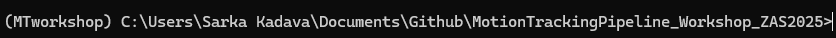

# Workshop: How to build your motion tracking pipeline

This repository stores all materials for a workshop on **How to build your motion tracking pipeline** which takes place on the 12th and 13th of March at ZAS (Berlin).

To make sure we all start on the same page, please prepare your laptop by following the instructions below. 

## Get ready

### Step 1: Installing Python

To be able to follow the workshop and explore the coding procedures of building a motion tracking pipeline, you will need to have a Python available. 

The easiest way to get Python is installing [Anaconda](https://www.anaconda.com/download), a common platform for this programming language.

> [!IMPORTANT] 
> At some point during the installation process, you need to check :ballot_box_with_check: that you want **to add Anaconda/Python to system path**. Without that, your command prompt or the text editor will not know where to find executor. 

If you feel you need a guidance, you can follow one of many tutorials online (e.g., [here for Mac]( https://www.youtube.com/watch?v=YJC6ldI3hWk), and [here for Windows](https://www.youtube.com/watch?v=UTqOXwAi1pE)). 

### Step 2: Get yourself a fancy text editor

To work with Python scripts, it is very convenient to have a text editor. Essentially, this can be any software that can edit texts, but I personally recommend - and for this workshop highly encourage - to use [Visual Studio Code](https://code.visualstudio.com/).

Once you have installed it, you need to do few more adjustments so that VS Code can recognize a Python script. Go to Extension panel (*Ctrl + Shift + X*) and search for Python. Click on the install button, et voilà! 

> [!TIP] 
> One of the reasons why VS Code is really nice lies in the extensions. One of my favorites is [Data Wrangle](https://code.visualstudio.com/docs/datascience/data-wrangler) that allows you to look through your dataframe in much more friendly way than, for instance, RStudio (no hate though :angel:)

### Step 3: Clone/download the repository

Once you are all set up, it's time to get this repository to your PC.

Here, you can either use [Github Desktop](https://desktop.github.com/download/) which will later also allow you to synchronize your local version of this repository with any updates I may do here.

> [!NOTE] 
> **How to clone repository via Github?** After installing, launching Github Desktop, and signing in with your Github credentials, simply click on *File > Clone repository... > URL* and paste there the link to this repository, https://github.com/sarkadava/MotionTrackingPipeline_Workshop_ZAS2025

If you don't want to install yet another software, you can just download the repository. At the top of this page, click on **<> Code** and then **Download ZIP**. This will download the repository.


### Step 4: Prepare your environment

During the workshop, we will work with so-called *virtual environment*. I will not go into details here, but environment essentially make sure that our project is safely isolated from the rest of the Python packages and certain versions therefore do not collide.

Now turn on your Anaconda Prompt and type

```
cd C:/Directory/where_the_downloaded/folder_lives
```

> [!CAUTION] 
> If you are a Mac user, you might notice that there is nothing like Anaconda Prompt to be found. You can simply use your Terminal.

Now it's time for our environment. You can create one by typing

```
conda create --name MTworkshop python=3.12
```

and then activate it with

```
conda activate MTworkshop
```
You should now see (MTworkshop) in the beginning of your line. 

Finally, we want to install some packages that I have prepared into the *requirements.txt* file. In your prompt, type

```
pip install -r requirements.txt
```

### Step 5: Verify that it worked

Now you can open your Visual Studio Code, click on *File > Open Folder* and select the folder where this repository lives. In the right panel, you should be able to see all the files. Click on the jupyter notebook Test.ipynb

Click on the play button. A window will pop up to select a kernel source. Click on *Select Python Environment* and now choose the one we have created a second ago, *MTworkshop*. If it worked, you should be able to see the name of the kernel in the top-right corner like so


When you click on the play button (or maybe even without that), most likely a window will pop up, asking you to install ipykernel on your VS Code. Click on install and wait until it finishes.


Now, finally, the moment of truth has come! If nothing screams red and a welcome message got printed, congratulations, you are ready to go! :blush:


## Troubleshooting

Unfortunately, there are many things on the way that can go wrong - for many reasons. Yes, technology can be too stubborn. While it is impossible to cover all of them, here are the most common errors you may encounter.

### *pip: command not found*

This error occurs when your system does not know where to find the *pip* command. Pip is either not installed in your environment, or it is not added to the system path.

#### Solution nr. 1

You can install pip by typing

```
conda install pip
```

If it does not work, refer to the next solution.

#### Solution nr. 2

Go to system settings and search for *Environment Variables*. Click on *Environment Variables* and in the *System variables* find *Path*. Click on *Edit* and then *New*. Now you need to add the path to your Anaconda. This is usually in *C:\Users\YourName\anaconda3\python.exe*.

### *I don't see MTworkshop environment in VS Code*

If you don't see the environment you have created in the list of available kernels, but are 100% sure that you have created it, go to your Anaconda Prompt and type

```
python -m ipykernel install --user --name=MTworkshop
```

Now you should see it in the list of available kernels. Note that maybe you will need to restart your VS Code.

### *ModuleNotFoundError: No module named 'mediapipe'*

If during the Step 5 you get this error (or some other module is missing), it means that the package was not installed. 

#### Solution nr. 1

You can try either reinstalling the whole requirements

```
pip install -r requirements.txt
```
>[!IMPORTANT]
> Make sure that you are in your MTworkshop environment. It should be displayed in brackets at the beginning of your prompt.


#### Solution nr. 2

Or just install the missing package

```
pip install mediapipe
```

### Did I not address your problem?

If you have encountered a problem that is not listed here, please let me know - ideally **before** Wednesday. I will do my best to help you out. You can reach me via email *kadava[et]leibniz-zas[dot]de*